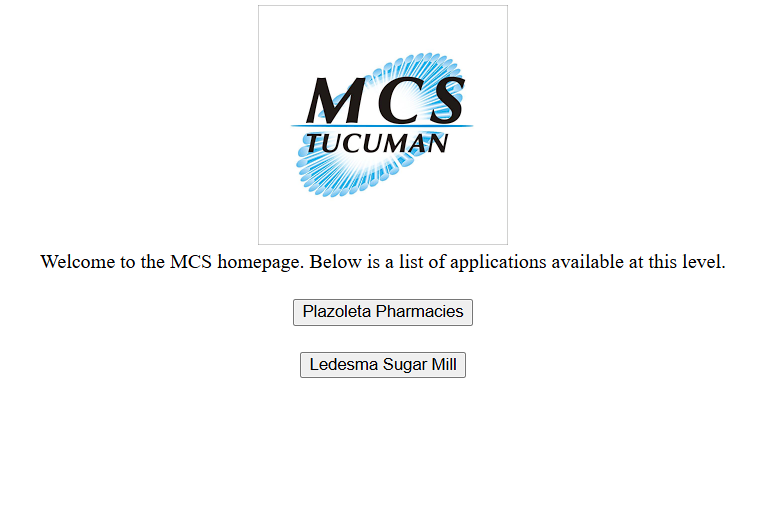

# **MCS**  
_Web application built using Python and Django, deployed on AWS._

## **Overview**  
This application interacts with a **SQLite database** to **add, modify, and delete records**, which are reflected in reports. The front-end utilizes **HTML and CSS** for basic structure and styling.

## **Language & Accessibility**  
📝 *This application is in **Spanish**. If you need to view it in another language, please enable automatic translation in your browser.*

## **Live Demo**  
🔗 [Live Demo](http://51.20.74.159:8000/)  
⚠️ *This is a portfolio project, and the live link may change. Please check this README for the latest version.*

## **Installation & Setup**  
💡 *These steps are intended for users with a basic understanding of Python and Django. If you are unfamiliar with these technologies, it's recommended to explore the **Live Demo** first.*

1. Clone the repository:  
   ```bash
   git clone https://github.com/HectorSchau/mcs.git
   cd mcs
2. Create a virtual environment and install dependencies:
   ```bash
   python -m venv venv
   source venv/bin/activate  # (Windows: venv\Scripts\activate)
   pip install -r requirements.txt
3. Run database migrations:
   ```bash
   python manage.py migrate
4. Start the development server:
   ```bash
   python manage.py runserver
5. Access the app in your browser at http://127.0.0.1:8000/.

## **How to Access the Live Version**  
For testing the deployed version, use the Live Demo link above.
If authentication is required, use the following demo credentials:
   ```bash
   Username: guess  
   Password: 123456
   ```

## **Technologies Used** 
- Backend: Python, Django
- Database: SQLite
- Frontend: HTML, CSS
- Hosting: AWS

## **Features**   
✔️ Add, update, and delete records from the database
✔️ Generate reports based on stored data
✔️ Simple and responsive UI with basic styling

## **Future Improvements**   
- Improve the front-end experience
- Implement user authentication for enhanced security
- Expand database functionality
- Add bilingual support (Spanish & English)

## **Application Walkthrough**     
Below are the key screens of the application, along with brief descriptions of their functionality.
1. Welcome Screen
This is the application's welcome screen. It represents the fictional company MCS, which provides system services to the businesses Plazoleta Pharmacies and Ledesma Sugar Mill. To proceed, please click the button "Plazoleta Pharmacies".

